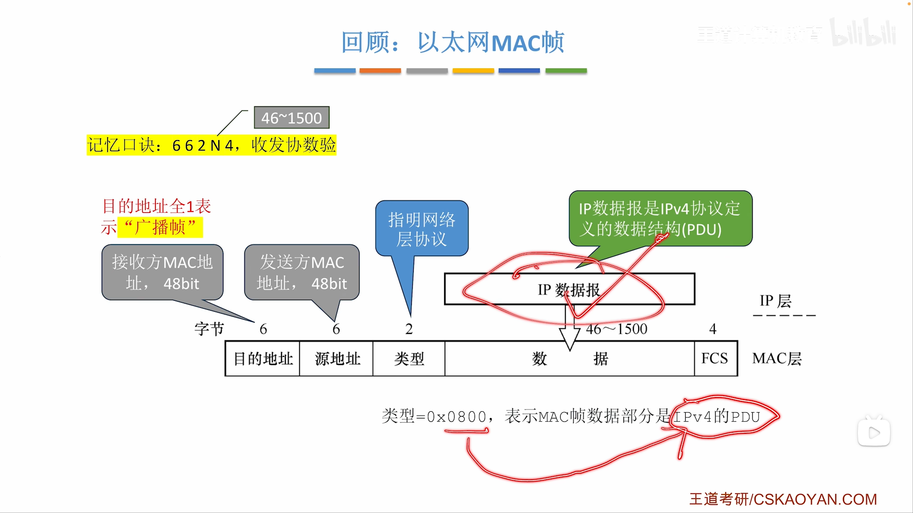
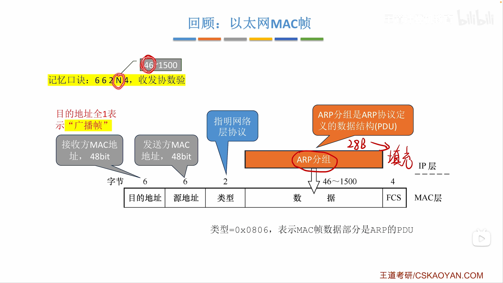
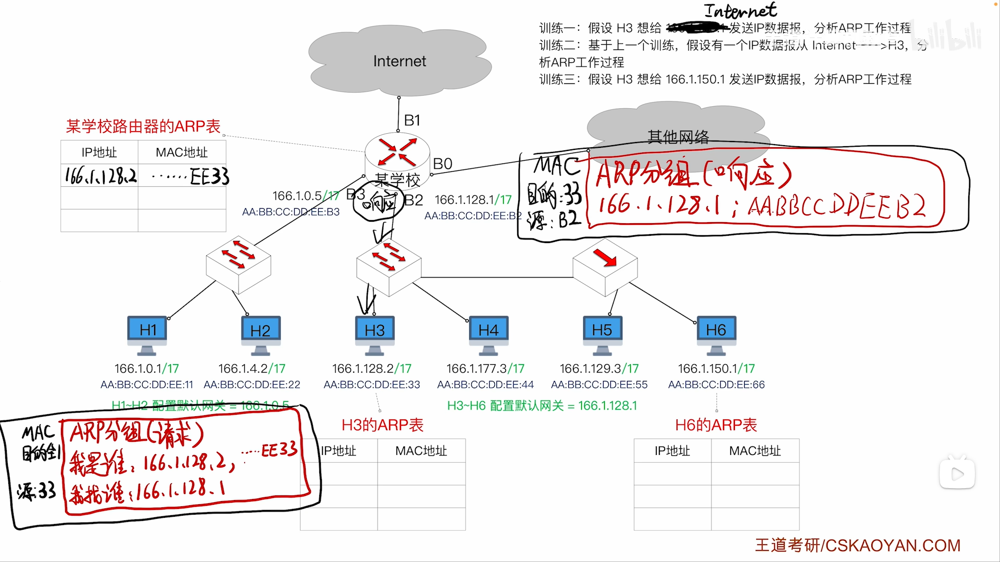
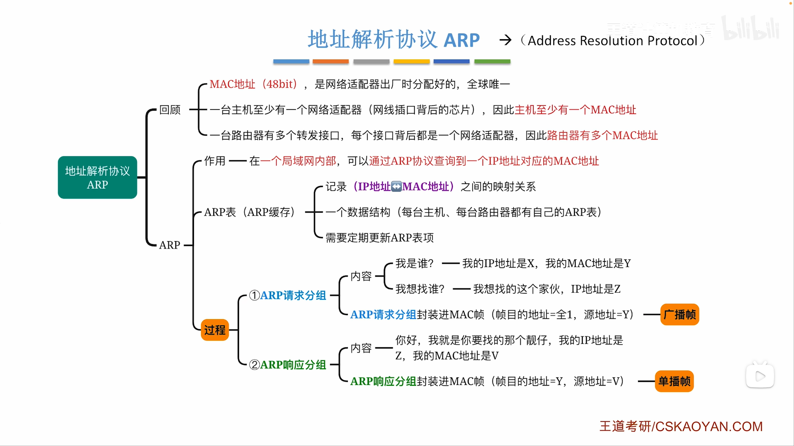

# 网络层

* 应用层 	-> 传输层 	-> 网络层             	-> 数据链路层	 -> 物理层

  报文    	 -> 报文段 	-> IP数据报/分组	-> 帧                	-> 比特

  ​						添加首部			添加首部、尾部	

* **网络层** 实现 **主机 <-> 主机** 间的传输

* **IP 协议是互联网的核心**

* TCP、UDP、ICMP、IGMP协议 

  ​	-使用-> IP协议 

  ​		-使用-> ARP、802.3、802.11协议

## 网络层功能

* 功能：
  1. 实现异构网络互联 —— 消除物理层、数据链路层的差异
  2. 路由与转发 —— **路由**需要**多台**路由器运行相同的路由协议，**转发**只需要**一台**路由器根据自己的路由表进行
  3. 拥塞控制 —— 网络上的分组在增多，但吞吐量反而下降
     * **开环控制(静态方案)** —— 提前规划解决方法，系统运行后无法修改方案
     * **闭环控制(动态方案)** —— 实时监控拥塞并调整路由表

* **路由器 = 网关 = Gateway**

* 路由器会对IP分组头进行差错校验
* 网络层不保证可靠传输

## 网络层提供的两种服务

### 1）面向连接的虚电路服务

* 虚电路 —— 在逻辑上提前规定好通信线路
* 虚电路 + 可靠传输的网络层协议 = 在网络层就能实现可靠传输

### 2）无连接的数据报服务（IP协议	

* 无连接的数据报服务 —— 每个分组都独立选择路径

* 无连接的数据报服务 = **无法在网络层实现可靠传输**

* **可靠传输**成为网络边缘设备（**主机**）需要负责的任务

  降低了网络核心设备（路由器）的复杂度

## IP数据报/IP分组

### 1）首部长度、总长度

* IP数据报 =  首部 + 数据

  **首部 = 固定20B + 可变40B** 

* **版本 —— 占 4bit，代表IP协议的版本(IPv4 or IPv6)**

* **首部长度 —— 占 4bit，代表首部的总长度(以4B为单位)**

  位数占4bit，可以表示0-15，所以首部长度最多60B，所以首部可变长度最多40B，并且**结尾要填充**够4的整数倍)

* **总长度 —— 占 16bit，代表IP数据报总长度(以1B为单位)**
  * 位数占16bit，可以表示0-65535，但上限还受到数据链路层限制

* 表示头部长度的内容显示 5H ，意味着该IP数据报的头部长度是 5*4B = 20B
* 表示总长度的内容显示 0030H，意味着该IP数据报的总长度是 48*1B = 48B，即数据部分长度是 48-20=28B

实际上，IP数据报的长度还受到数据链路层协议的限制：

* 以太网帧 662N4 收发协数验，最短帧长64B，最长帧长1518B

  所以数据部分长度范围 46B - 1500B

  即**以太网的MTU = 1500B**

* 数据链路层允许的**最大数据量 = 最大传送单元 = MTU**

* 如果IP数据报的总长度 > MTU，需要**分片**

  最后分片会在**目的主机的网络层**进行**重组**

* 对IP数据报分片时，**每个分片都要保留首部信息**

  方便每个分片都作为一个独立的IP数据报被路由转发

### 2）标识、标志、片偏移

* **标识 —— 占16bit，由同一个IP数据报分片得来的各个数据报，标识相同**

  是IP分组的身份证，一般是由源主机生成的自增序列

* **标志 —— 占3bit，最低位MF，次低位DF**

  * **MF = 1**，代表**后边还有分片**
  * **DF = 1**，代表**不允许分片**（如果一个2000B、DF=1的IP数据报进入MTU=500B的链路，网络层无计可施，需要发送一个代表报错的报文 ICMP报文 还给源主机，让源主机处理这件事）

* **片偏移 —— 占13bit，表示当前分片在原数据报的起始位置，以8B为单位**

* **IP数据报分片后首部和原首部不同，各分片的首部也不同**

* 片偏移表示当前分片在原数据报的起始位置

  * 第一个分片的片偏移是0
  * 分片后再分片，片偏移还是最初的片偏移

* $MF=0$ 有可能是独立的数据报，也有可能是最后一个分片

  只有当$MF=0$且片段偏移字段$>0$时，才能确定是分片的最后一个分片

* 片偏移以8B为单位，这意味着**除了最后一个分片，其他分片的数据部分必须是8B的整数倍**

  例如上图前两个分片的片偏移分别是0、185，意味着它们在原IP数据报的起始位置分别是0、1480，而且满足1480%8=0

* 当 `原IP数据报长度 > 链路MTU && DF==0`时，会发生分片

  而不同链路的MTU不同

  所以**“分片”可能发生在源主机或路由器**

* 分片发生在发送主机/路由器的网络层

  分片的**“重装”也只会发生在目的主机的网路层**

* 片偏移以8B为单位

* 片偏移以**8B为单位**，而且片偏移量必须是**整数**，所以分片**有可能不分满MTU**

### 3）TTL、协议、首部校验和

* **TTL = 生存时间 = 跳数 —— 占8bit，代表当前IP数据报允许通过的路由器数量**

* 源主机设定TTL，经过的路由器都会自动 -1。

  如果某个路由器 -1 后发现 TTL=0，立即丢弃该IP数据报，并向源主机发送ICMP报文表示异常

* TTL可以防止路由环路导致的报文死循环

* **协议 —— 占8bit，提示数据部分使用的哪种协议**

  （版本 —— 占4bit，提示网络层使用的是IPv4协议还是IPv6协议）

* **首部校验和 —— 占16bit，校验整个首部**，校验方式和UDP的校验方式相同

  由于TTL变化、分片操作等，每经过一个路由器，首部校验和部分都会发生变化

* 首部校验和是全0时，表示不用校验

  网络层只校验首部，不负责数据部分的差错控制

### 4）源地址、目的地址

* 源地址 —— 32bit，表示发送方的IP地址
* 目的地址 —— 32bit，表示接收方的IP地址
* 418，首总偏

## IP地址分类演变

* 分类演变：

  ABCDE —> 子网划分 —> CIDR —> NAT

### 1）ABCDE类地址

* **IP地址资源由 ICANN 进行分配**
* A、B、C、D、E类地址，前缀分别是 **0、10、110、1110、1111**

* A类地址中 —— 
  * **网络号0**保留，不指派
  * **网络号127**用于**环回地址检测**，不指派

* A、B、C类地址称为**单播地址**，网络号分别占**8、16、24bit**

  只有A、B、C类地址可以被分配给单个主机或路由器

* D类地址称为多播地址，E类地址称为保留地址

* IP地址有 32bit，IP地址 = 网络号 + 主机号
* 如何区分A、B、C类地址 —— 根据前8个bit的范围（前缀是0、10、110）

* 路由器和路由器连接的接口** **IP地址

  路由器**和其它主机连接的接口必须有IP地址** 

* **同一个网络**里所有主机、路由器接口的**网络号必须相同**

* **默认网关 —— 主机连接的第一个路由器**

* 直接交付 —— 同一网络内通信
* 间接交付 —— 跨网络通信

* 发送方 —— 要检查是否 自己的网络地址 == 接收方的网络地址
  * 是 ——直接交付（不跨网络，直接通过ARP协议获取对方MAC地址，发送以太网帧给接收方）
  * 不是 —— 间接交付（跨网络，根据ARP协议获取默认网关的MAC地址，发送以太网帧给路由器，剩下的交给路由器）
* 路由器 —— 用目的IP地址 和 每一个路由表表项做对比
  * 相同 —— 转发到对应端口
  * 不同 —— 继续对比下一项（最后一项意为“其它”）

### 特殊用途的IP地址

* 有网络号，主机号全0 —— 整个网络，主要用于转发表

* 有网络号，主机号全1 —— 广播给对应网络

  所以一个A类地址，只能分配 $2^{24} - 2$ 个IP地址，因为主机号全0和全1的IP地址不允许分配给具体主机（B、C类网络也类推）

* 网络号全0，有主机号 —— 本网络内部的某主机（只能作为源地址使用）

* 网络号全0，主机号全0 —— 本主机（只能作为源地址使用）

* 网络号全1，主机号全1 —— 广播给本网络

  当一个主机**初次接入**某个网络，会以**源地址全0，目的地址全1**的格式广播DHCP报文，DHCP服务器收到后就分配一个IP地址给它

* 网络号是127，主机号不是全0或全1 —— 环回自检地址，主要用于服务器开发

* 分配地址时，需要考虑路由器也占用一个接口
* 如果题中没有特别指出，当要求分配网络号时，也应该给路由器和路由器之间分配网络

### 2）划分子网

* 划分子网 —— 划分**主机号**，让一个网络生成多个**大小相等**的子网
* **网络地址** = **IP地址**和**子网掩码**进行**与运算**（子网掩码前边全1后边全0）
* 子网掩码对ABCDE类网络是**兼容**的，路由器**默认分配子网掩码**（例如A类网络的子网掩码就是255.0.0.0）

* 和ABCDE类网络一样，子网划分也**不允许主机号部分是全0或全1**

* IP数据报的转发 —— 

  1. 判断发送方和接收方的**网络地址**是否相同（网络地址 = **IP地址** 和 **子网掩码** 进行**与运算**）

  2. * （在同一子网）用ARP协议获得接收方的MAC地址，不需要经过默认网关，发送方自行转发给接收方

     * （在不同子网）发送方把数据发给默认网关（目的MAC写默认网关的MAC）

       3. 默认网关依次把目的IP地址和路由表里每一项记录的子网掩码想与，结果与子网号相等，转发到对应端口

          如果没有匹配的子网号，路由器会以太网帧发送到**默认路由**对应的端口

* **默认路由 —— 子网掩码全0，网络号全0，在转发表的最后一行**（任何IP地址都一定能匹配上）

* **子网掩码的简易写法** —— 例如 166.1.0.0,255.255.128.0，可以简易写成**166.1.0.0/17**

* 自治系统 —— 减小了路由器的负载，门户路由器只需要负责和其它网络通信，不需要负责网络内部通信

### 3）CIDR（构建超网）

* 子网掩码是对ABCDE类网络进行再划分，网络号固定（只能是8bit、16bit、24bit）然后对主机号划分形成子网

  CIDR取消掉了ABCDE类地址的概念，**网络号可变长**，然后**也能**对主机号划分**形成子网**

#### （1）定长子网划分 FLSM

* 缺点是每个子网一样大，不灵活

#### （2）变长子网划分 VLSM

* 变长子网划分 —— 可以根据需求量分配子网大小
* 一级ISP、二级ISP

* 总结：一共有 5bit 主机号，现在有3个子网，分别有12台主机、5台主机、1台主机
  * 根据“路由器和路由器相连的接口可以没有IP地址，路由器和主机相连的接口必须有IP地址“，每分配一个子网，路由器要消耗一个IP地址

* 每次划分子网：

  * 全0主机号表示整个子网
  * 全1主机号表示广播地址
  * 路由器和子网连接的接口要消耗一个IP地址

  所以**创建子网时就消耗了3个IP地址**了（但考试问的时候，还是说有 $2^n-2$ 个IP地址可用）

* 划分子网时主机号的位数最低2位（2位保证有4个地址，这样还剩最后一个地址可以分给主机）

* CIDR构建子网，类似于哈夫曼编码，要保证子网之间不会出现前缀重合

* 类似考点：已知哈夫曼树的叶子结点个数n，问构建的哈夫曼树最高有多少层(n-1)

#### 路由聚合

* 路由聚合

  * 要求 —— **转发接口相同**；**前缀重合**

  * 优：减小路由表；路由变快

    缺：可能纳入无效地址

* 最长匹配原则 —— 如果IP地址和路由表中的多个项匹配，以**匹配长度最长**的那个为准

* 一个主机可以连接多个路由器，因此**默认网关（默认路由器）**的存在是有意义的

* CIDR也兼容划分子网、ABCDE类地址

### 4）网络地址转换 NAT

* 目前通信最常使用的就是NAT

* 网络层实现 主机到主机 的通信

  传输层实现 端到端 的通信

* **NAT —— 一个局域网有一个IP地址**，网内所有主机共享这个IP地址
* 根据 **IP地址+端口号** 确认 **进程**

* **公网IP = 外网IP** —— 局域网对外暴露的全球唯一的IP地址

  **内网IP** —— 局域网自行分配，局域网内唯一，全球不唯一

  ​			内网IP **10.0.0.0 - 10.255.255.255**、**172.16.0.0 - 172.31.255.255**、**192.168.0.0 - 192.168.255.255**

  ​			这些IP只能用于内网IP，内网IP也只能使用这些IP，不允许外网IP使用这些IP

* **NAT表** 记录 **外网IP+对外端口 <-> 内网IP+主机端口** 的映射关系

* 发送方 -> 发送方默认网关 -> ... -> 接收方默认网关 -> 接收方

  1. **发送主机**发送数据

     * TCP/UDP协议会记录源端口、目的端口；

       IP协议会记录源IP地址、目的IP地址；

     * 发送方主机里存储的 源IP地址+源端口号 = **发送方内网IP+主机端口**

       ​				目的IP地址+目的端口号 = **接收方公网IP+对外端口**

  2. **发送方的默认网关**修改源IP地址+源端口号，修改成 **发送方公网IP+对外端口**
     * **NAT 路由器**会修改端口号，这意味着它实现了部分 **传输层** 的功能

  3. **接收方的默认网关**修改目的IP地址+目的端口号，修改成 **接收方内网IP+主机端口**，然后发送给接收方

* 发送方 -> 发送方默认网关 -> ... -> 服务器

* 服务器 -> ... -> 发送方默认网关 -> 发送方

#### 虚拟专用网VPN

* 虚拟专用网VPN = IP隧道技术 —— 

  公司的内部网络使用的都是私有IP，只有路由器需要公有IP

  信息经历因特网，从一个私有IP局域网，到另一个私有IP局域网，两边路由器实现 私有IP <-> 公有IP 的转换

  局域网内的主机感受不到经历了因特网，好像两个网间有一个直连隧道一样

* 除了**内联网VPN**，还有 **外联网VPN**、**远程接入VPN**

## 静态路由配置、路由环路

* 静态路由配置 —— 人工填写路由表（路由表静态，不能自适应网络动态变化）
* **静态路由配置**可能导致**路由环路**

* 直连网络不需要配置，路由器可以自动检测

### 默认路由、特定主机路由

### 1）静态配置出错导致路由环路

* TTL —— 数据报最多允许经历的跳数（防止由于路由表配置错误导致的路由环路）

### 2）聚合不存在网络导致路由环路

* 路由聚合可能会聚合不存在的网络，导致路由环路问题

* 黑洞路由 —— 匹配黑洞路由的数据报，会被丢弃

* 黑洞路由 + 最长前缀匹配原则 = 解决路由聚合产生的问题

### 3）网络故障导致路由环路

* R1把故障部分的路由项删除，但R2不知道这件事，导致路由环路

* 解决方式 —— 网络故障时，不直接删除路由项，而是用黑洞路由取代

## 路由选择协议

* 静态路由 - 人工
* 动态路由 - 自动

* 因特网是最大的网络，使用动态路由选择协议
* 不同的AS内部、AS的内部和外部，都可以使用不同的路由选择协议

* 域间路由选择、域内路由选择

* 外部网关协议EGP = 外部路由器协议ERP

  内部网关协议IGP = 内部路由器协议IRP

### 路由器基本结构

* 路由器根据收到的路由报文，更新自己的路由表

  路由器也会定期发送路由报文给其他的路由器

​	即：因特网路由选择协议的**分布式**特点 —— 路由器之间交换路由信息

### 1）路由信息协议 RIP

* RIP是内部网关协议(**IGP**)，要求每个路由器都知道到达本AS内所有网络的下一跳
* RIP规定距离为**16**时不可达

* RIP 提倡 **短路由是好路由**
* 如果最短路由有多条，RIP支持**等价负载均衡**（将通信量均衡的分布到多条等价路由上）

#### 根据RIP协议修改路由表

* **RIP**规定，路由报文只能**周期性**把自己的**路由表**发给**相邻路由器**
* 接收者不关心到相邻路由器到下一跳的路径，**只关心距离**

* RIP协议规定 **距离16 = 不可达**

* RIP协议特点：**坏消息传得慢**
  1. 限制**最大路径=15**
  2. 路由表**变化后触发更新**，也就是立即发送路由报文，不等周期
  3. **水平分割**，路由器从某个接口接收到的更新信息不允许再从这个接口发回去

​	RIP协议**只能减轻，不能解决路由环路**问题

* R3能检测到网络**不可达** = R3和该网络是**直连**的 + 该网络和R3的通路**故障**
* R2不仅会收到R3的周期消息，也会收到R1的周期消息，一 轮刷新后的最近距离会是3

### 2）开放最短路径优先 OSPF

* **RIP协议**的路径长度，是根据**中间路由器个数**确定的，只适用于**小规模网络**，可能会产生路由环路（坏消息传播得慢）

  **OSPF协议**的路径长度，是根据**链路状态**确定的，**不限制网络规模**，**不会产生路由环路**

* 决定链路状态的因素，由网络管理人员决定，例如把带宽计入考虑范围

* OSPF的路由器之间通过**“问候”消息**维护邻居关系

  **死亡倒计时** —— 问候消息10s一次，如果超过40s没有接收到邻居关系，默认该邻居已不可达

* 问候消息 —— 目的IP地址是**组播地址224.0.0.5**，目的**端口号是89**，表示该消息是OSPF消息

#### LSA、LSU、LSDB

* 链路状态通告LSA —— 包含该路由器的**直连网络、邻居路由器**的链路信息

* 链路状态更新分组LSU —— 封装了LSA信息的路由分组，通过**洪泛法**发送

  每个路由器都通过洪泛法发送自己的LSU

* 链路状态数据库LSDB —— 在所有路由器都用洪泛法发送了自己的LSU后，所有路由器的LSDB一致

* OSPF，其中O指“开放”，SPF指最短路径优先

  在LSDB一致后，根据Dijkstra的SPF算法，各路由器可以得出到达其他路由器的最短路径

#### 五类分组

* 路由器不是无脑发送自己的LSU，而是先发**摘要**，其他数据库检测到有未知内容后**请求发送具体**内容，然后路由器才用**洪泛法发送更新**信息，接收方还需要发送**确认**消息

#### DR、BDR

* 为了减少洪泛法发送的LSU，路由器中选举出DR、BDR

  所有路由器仅和DR、BDR建立邻居关系，减少了分组发送

  如果DR出现故障，由BDR承担DR的工作

#### 划分AS

* RIP只适用于小型网络，但OSPF不限制网络规模

  因为OSPF会划分AS，把一个AS划分成若干区域，**洪泛法只在小区域内部发生**，区域间的LSA流动仅通过区域边界路由器和主干路由器的交互实现

### 3）边界网关协议 BGP

* IGP —— 包括RIP、OSPF

  EGP —— 包括BGP

* 在RIP中，“代价”是路由器个数

  在OSPF中，”代价“是指定的传输性能指标

  在EGP中，由于连接不同的AS，可能使用不同的IGP算法和指标，需要有统一的度量

* 在EGP中要考虑政治、经济、安全等因素，而且统一度量“代价”很难实现
* 因此，**EGP的算法不追求最小代价，仅追求可达**

#### BGP发言人

* BGP使用传输层的TCP协议，端口号是179

* **BGP发言人仅考虑可达**

* BGP适用于多级结构的AS

#### 四类分组

* RIP由传输层的UDP协议封装

  OSPF由网络层的IP协议封装

  BGP由传输层的TCP协议封装

* RIP、OSPF、BGP是为网络层工作的应用，它们本身在应用层

|   协议   |                    RIP                     |                 OSPF                 |                  BGP                   |
| :------: | :----------------------------------------: | :----------------------------------: | :------------------------------------: |
|   类型   |                    内部                    |                 内部                 |                  外部                  |
| 路由算法 |                 距离-向量                  |               链路状态               |               路径-向量                |
| 传递协议 |                    UDP                     |                  IP                  |                  TCP                   |
|   层次   |                   应用层                   |                网络层                |                 应用层                 |
| 路径选择 |                  跳数最少                  |               代价最低               |              较好，非最佳              |
| 交换结点 |            和本结点相邻的路由器            |          网络中的所有路由器          |          和本结点相邻的路由器          |
| 交换内容 | 当前本路由器知道的全部信息，即自己的路由表 | 与本路由器相邻的所有路由器的链路状态 | 首次是整个路由表，非首次是有变化的部分 |

## 网际控制报文协议 ICMP

* ICMP分为**差错报告**报文、**询问**报文
* ICMP报文被封装在 **IP数据报** 中发送

### 1）ICMP差错报告报文

#### 五类分组

#### 不应发送的情况

### 2）ICMP询问报文

#### 两类分组

### ICMP应用

* 跟踪路由的原理 —— 

  * H1给H2发送ICMP请求报文，并且TTL=1。则途径的第一个路由器会让TTL=0并发送ICMP时间超过报文

  * H1给H2发送ICMP请求报文，并且TTL=2。则途径的第二个路由器会让TTL=0并发送ICMP时间超过报文

    ...

  * H1给H2发送ICMP请求报文，并且TTL=n。这次到达了H2，H2发送了ICMP回答报文

  通过这一系列的操作，H1就能知道，H1到H2要经历哪些路由器

## 地址解析协议 ARP

* ARP协议和IP协议都在网络层，它们的地位是等同的
* ARP帧通常很短，需要填充（以太网帧允许承载的数据是 46-1500B）

* **ARP**的作用是查询**同一个网络**中IP地址对应的**MAC地址**
* MAC地址属于**网卡**（网络适配器），所以一台计算机/路由器可能会有多个MAC地址

* 每台主机、路由器上都有自己的ARP表，在**接入网络之前ARP表为空**（ARP表会**定时更新**）

* ARP工作原理：

  1. 广播ARP帧 —— 声明**自己的IP地址、MAC地址**，以及需要知道MAC地址的主机的**IP地址**
  2. 响应单播ARP帧 —— 对应IP地址的主机把**自己的IP地址、MAC地址**，响应给提问方

* 广播消息到时，被提问的主机把提问方的 IP地址<->MAC地址映射 存入自己的ARP表

  单播消息到时，提问主机把响应得到的被提问方的 IP地址<->MAC地址映射 存入自己的ARP表

* 在训练3，H6的响应ARP帧会被集线器无脑转发给交换机和H5

  H5拆分目的MAC地址，发现**不是发给自己的帧**，直接**丢弃**

# 11111111111111111111

#### VPN

当目的地址是私有（专用）$IP$地址时路由器一律不转发，而如果在内网的私有$IP$地址要转发或接收本地网络其他主机的数据怎么办呢？

可以利用公用的互联网作为本地各专用网之间的通信载体，这种网络就是虚拟专用网$VPN$。这种网络不同于互联网是因为它只用于本地网络的通信，但是又依靠互联网传输，所以就需要对数据进行加密。

当$VPN$需要外部机构加入就是外联网$VPN$；如果成员分布分散，通过某种软件建立$VPN$通道，这种$VPN$就是远程接入$VPN$。

### IPv6

无论是$NAT$技术还是$CIDR$技术都无法完全解决$IPv4$地址耗尽的问题，所以就出现了$IPv6$从根本上解决地址耗尽的问题。

解决的问题有：

1. $IP$地址不足，增加到了$128$位。
2. 改进首部格式，简化$IP$地址类型，且首部长度固定。
3. 快速处理/转发数据报，去掉了差错检验，不允许分片。
4. 支持$QoS$（服务质量指一个网络能够利用各种基础技术，为指定的网络通信提供更好的服务能力，是网络的一种安全机制，用来解决网络延迟和阻塞等问题的一种技术）。

#### IPv6帧格式

$IPv6$帧包括$40$字节即$320$位的基本首部，再加上不超过$65535$字节的有效载荷，有效载荷中包含着多个拓展首部与数据部分。

其中报头格式如下：

![IPv6报头格式][IPv6headerformat]

|              名称              |                             作用                             | 位数  |
| :----------------------------: | :----------------------------------------------------------: | :---: |
|          版本 Version          |            指明协议版本，此处因为是ipv6所以总是6             |  4位  |
|      优先级 Traffic Class      |                   区分数据报的类型和优先级                   |  8位  |
|       流标签 Flow Label        |  和ipv4标识某个数据报分片不同，这是对于一整个数据报流的标记  | 19位  |
|  有效载荷长度 Payload Length   | 指的是扩展首部+数据部分的大小，和ipv4的总长度和首部长度都不同，ipv6的首部长度是固定的40字节 | 16位  |
| 下一个首部（报头） Next Header | 基本首部的下一个首部指的是有效载荷里标记的的扩展首部，有效载荷里的扩展首部再指向有效载荷里标记的的扩展首部，直至最后指向数据 |  8位  |
|       跳数限制 Hop Limit       |    基本相当于ipv4当中的TTL，每到一个路由器-1.减到0时丢弃     |  7位  |
|     源地址 Source Address      |                        发送方ipv6地址                        | 128位 |
|  目标地址 Destination Address  |                        接收方ipv6地址                        | 128位 |

#### IPv6与IPv4的区别

1. 地址空间扩大，由$32$位变为$128$位。
2. 将校验和字段彻底移除，减少每跳处理时间。
3. 将可选字段移出首部，首部长度固定，变成扩展首部（丢弃了首部长度字段），更加灵活。
4. 路由器一般不对扩展首部检查，提高处理效率。
5. 支持即插即用，不需要$DHCP$协议。
6. 首部是$8$字节的整数倍，而$IPv4$首部是$4$字节的整数倍。
7. 只能在主机处分片，而$IPv4$能在主机和路由器处分片，所以$IPv6$不允许分片。（如过大在路由器会无法分片而无法传输的话，会用$ICMPv6$返回差错报文）
8. 支持资源预分配，支持实时视像等要求，保证一定的带宽和时延的应用。
9. 取消了协议字段。
10. 取消了总长度字段，改成有效载荷字段。
11. 取消服务类型字段。

#### IPv6地址表示

一般形式：冒号十六进制记法。（分为八个十六进制端）

压缩形式：一段中有连续的$0$，可用一个$0$代替；把在前面的$0$全部删去；使用零压缩的方式，一串连续的$0$可用用一对冒号代替，但是只能在一个地址中使用一次。

#### IPv6基本地址类型

| 名称 |                             作用                             |         要求         |
| :--: | :----------------------------------------------------------: | :------------------: |
| 单播 |                          一对一通信                          | 可做源地址，目的地址 |
| 多播 |       一对多通信，以前的广播地址当做覆盖所有主机的多播       |     可做目的地址     |
| 任播 | 一对多当中的一个通信，看似一对多，实则一对一，一般是最近的主机 |     可做目的地址     |

#### IPv4和IPv6之间的过渡

+ 双栈协议：在一台设备上同时启用$IPv4$协议栈和$IPv6$协议栈。这样的话，这台设备既能和$IPv4$网络通信，又能和$IPv6$网络通信。如果这台设备是一个路由器，那么这台路由器的不同接口上，分别配置了$IPv4$地址和$IPv6$地址，并很可能分别连接了$IPv4$网络和$IPv6$网络。如果这台设备是一个计算机，那么它将同时拥有$IPv4$地址和$IPv6$地址，并具备同时处理这两个协议地址的功能。
+ 隧道技术：通过使用互联网络的基础设施在网络之间传递数据的方式。使用隧道传递的数据（或负载）可以是不同协议的数据帧或包。隧道协议将其它协议的数据帧或包重新封装然后通过隧道发送。

## IP多播

$IP$多播也称为组播。所以肯定仅用于$UDP$。

当网络中某些用户需要特定数据时，组播数据发送者仅发送一次数据，避免路由环路，借助组播路由协议为组播数据包建立**组播转发树**，被传输的数据到达距离用户端尽可能近的结点后才开始复制和分发。

组播提高了数据传输效率，降低拥塞的可能性，组播组中的主机可以时同一个物理网络，如果有组播路由器也可以来自不同物理网络。

能运行组播协议的路由器就是组播路由器。

### 组播实现

因特网的组播是靠路由器来实现的，这些路由器必须增加一些能够识别组播的软件。能够运行组播协议的路由器可以是一个单独的路由器，也可以是运行组播软件的普通路由器。因特网上的组播比以太网上的组播复杂得多，因为以太网本身支持广播和组播，而因特网上当前的路由器和许多物理网络都不支持广播和组播。

多个单播可以仿真组播，此时仿真的实验基本上是相同的，但是一个组播所需要的带宽小于多个单播带宽之和，此时路由器的时延变大，而处理一个组播分组的时延是比较小的。

### IP组播地址

$IP$组播地址能让源设备能将分组发送给一组设备，属于多播组的设备将被分配一个组播组$IP$地址。

组播地址范围是$244.0.0.0$到$239.255.255.255$，一个$D$类地址表示一个组播组，只能用作目的地址，源地址必然是单播地址。

1. 组播数据报由于是组播所以不是一对一，所以无法建立连接，仅能应用于$UDP$，只能尽最大努力交付，不提供可靠交付，。
2. 对组播数据报不产生$ICMP$差错报文。
3. 并非所有$D$类地址都可以作为组播地址。

### 硬件组播

同单播地址一样，组播$IP$地址也需要对应的组播$MAC$地址在本地网络中实际传输帧。组播$MAC$地址以十六进制值$01-00-5E$开头，即范围为$01-00-5E-00-00-00\sim01-00-53-7F-FF-FF$，余下的六个十六进制位根据$IP$组播组地址的最后$23$位转换而成，第$9$位为$0$。

![硬件组播][hardwaremulticast]

有时候可能会$IP$地址映射成同样的$MAC$地址，从而数据组播时可能会出错，所以在收到多播数据报的主机，还要在$IP$层利用软件进行过滤，将不是本主机要接受的数据丢弃。

### IGMP协议

网际组管理协议让连接在本地局域网上的多播路由器知道本局域网上是否还有主机的某个进程参加或退出了某个多播组。

首部中协议字段值为$2$表示使用$IGMP$协议。

#### 工作阶段

1. 某主机要加入组播组时，该主机向组播组的组播地址发送一个$IGMP$报文，声明自己要称为该组的成员。本地组播路由器收到$IGMP$报文后，要利用组播路由选择协议把这组成员关系发给因特网上的其他组播路由器。
2. 本地组播路由器周期性探询本地局域网上的主机，以便知道这些主机是否还是组播组的成员。
3. 只要有一个主机对某个组响应，那么组播路由器就认为这个组是活跃的。
4. 如果经过几次探询后没有一个主机响应，组播路由器就认为本网络上的没有此组播组的主机，因此就不再把这组的成员关系发给其他的组播路由器。组播路由器知道的成员关系只是所连接的局域网中有无组播组的成员。

### 组播路由选择协议

组播路由协议目的是找出以源主机为根节点的组播转发树。

对不同的多播组对应不同的多播转发树；同一个多播组，对不同的源点也会也不同的多播转发树。

#### 组播数据报方法

1. 洪泛与剪除。
2. 隧道技术。
3. 基于核心的发现技术。

#### 建议组播路由选择协议

1. 距离向量多播路由选择协议$DVMRP$。
2. 基于核心的转发树$CBT$。
3. 开发最短通路优先的多播扩展$MOSPF$。
4. 协议无关多播-稀疏方式$PIM-SM$。
5. 协议无关多播-密集方式$PIM-DM$。

## MPLS

多协议标记交换利用面向连接的技术，使每个分组都携带一个叫做标记的小整数，当分组到达交换机时，交换机读取分组的标记，并用标记值来检索分组转发表。

$MPLS$具有以下特点：

1. 支持面向连接的服务质量。
2. 支持流量工程，平衡网络负载。
3. 有效地支持虚拟专用网$VPN$。

## 移动IP

移动$IP$技术是移动结点（计算机/服务器等）以固定的网络$IP$地址，实现跨越不同网段的漫游功能，并保证了基于网络$IP$的网络权限在漫游过程中不发生任何改变。移动结点具有永久$IP$地址的移动设备。

### 相关术语

+ 归属代理（本地代理）：一个移动结点拥有的就“居所”称为归属网络，在归属网络中代表移动节点执行，移动管理功能的实体叫做归属代理。
+ 外部代理（外地代理）：在外部网络中帮助移动节点完成移动管理功能的实体称为外部代理。
+ 永久地址（归属地址/主地址）：移动站点在归属网络中的原始地址。
+ 转交地址（辅地址）：移动站点在外部网络使用的临时地址。

### 通信过程

移动$IP$的基本工作过程可以分为代理发现、注册、分组路由与注销四个阶段

$A$刚进入外部网络：

1. 在外部代理登记获得一个转交地址，离开时注销。
2. 外地代理向本地代理登记转交地址。

$B$给$A$发送数据报：

1. 本地代理截获数据报。
2. 本地代理再封装数据报，新的数据报目的地址是转交地址，发给外部代理（隧道）。
3. 外部代理拆封数据报并发给$A$。

$A$给$B$发送数据报：

$A$用自己的主地址作为数据报源地址，用$B$的$IP$地址作为数据报的目的地址。

$A$移动到了下一个网络：

1. 在新外部代理登记注册一个转交地址。
2. 新外部代理给本地代理发送新的转交地址（覆盖旧的）。
3. 通信。

$A$回到了归属网络:

1. $A$向本地代理注销转交地址。
2. 按原始方式通信。

移动$IP$为移动主机设置了两个$IP$地址，即主地址和辅地址（转交地址）。移动主机在本地网时，使用的是主地址。当移动到另一个网络时，需要获得一个临时的辅地址，但此时主地址仍然不变。从外网移回本地网时，辅地址改变或撤销，而主地址仍然保持不变。

## 互联网连接问题

计算机网络中主机不仅需要跟其他主机相联，还需要跟互联网相联。

+ 当询问该网段的主机是否可以访问互联网时，要查看对应网段的默认网关地址，此时默认网关的地址必须跟连接的路由器的接口地址一致，那么可以访问互联网。
+ 当主机处于不同的网段（子网号不同）则需要路由器进行连接（就是互联网连接问题，因为不同网段主机访问即使再近都要访问互联网再找到该地址）。此时默认网关的地址必须跟连接的路由器的接口地址一致，否则不能通过路由器转发，从而无法连接。
+ 当一个路由表中要填写访问互联网的路径时，那么这个路径就是固定的$0.0.0.0$，掩码也是$0.0.0.0$。这样的话只要这个地址不与路由表中的其他所有地址匹配，那么他们都可以选择这个最终的方案通过互联网查找$IP$地址。
+ 如果是要到固定的设备，如域名服务器，则必须$IP$地址全部匹配，此时子网掩码就是$255.255.255.255$。

## 网络层设备

一般为路由器，是一种具有多个输入端口和多个输出端口的专用计算机，其任务是根据转发表分组转发。

若收到$RIP/OSPF$分组等，则把分组送往路由选择处理机；若收到数据分组，则查找转发表并输出。

功能为分组转发和路由计算，不进行差错检测。

路由器作用于物理层、数据链路层、网络层。

### 输入端口处理

1. 从线路接受分组。
2. 物理层进行处理。
3. 数据链路层进行处理。
4. 网络层进行处理，首先对数据进行分组与排队，再进行查表与转发。
5. 输出到交换结构中。

输入端口的查找和转发功能在路由器的交换功能中最重要。

### 交换结构

根据转发表对分组处理。

+ 通过存储器进行交换。
+ 通过总线进行交换。
+ 通过互联网进行交换。

交换结构由路由选择处理机、路由选择协议、路由表组成。

### 输出端口处理

1. 交换结构中收到分组。
2. 网络层进行处理，首先对数据进行分组与排队，速度太快需要放在缓存中并进行缓存处理。
3. 数据链路层进行处理。
4. 物理层进行处理。
5. 向线路发送分组。

若路由器处理分组的速率赶不上分组进入队列的速率，则队列的存储空间必然最终降为$0$，使后面再进入队列的分组由于没有存储而被丢弃。

路由器中的输入或输出队列产生溢出是造成分组丢失的主要原因。

### 三层设备的对比

+ 路由器可以互联两个不同网络层协议的网段。面向协议，根据不同协议进行不同操作。
+ 网桥可以互联两个物理层和链路层不同的网段。与高层协议无关
+ 集线器不能互联两个物理层不同的网段。

### 路由表与路由转发

路由表由路由选择算法得到，主要用于路由选择，总由软件实现。包括四个部分：目的网络$IP$地址、子网掩码、下一跳$IP$地址、接口。

其中路由表都有一个默认路由：$0.0.0.0$，其子网掩码为$0.0.0.0$，当不知道发送给谁时就发送这个默认路由，让别的路由器帮忙处理。

转发表由路由表而来，可以使用软件实现也可以使用特殊的硬件实现。转发表必须包含完成转发功能所必须的信息，在每一行都包含要达到的目的网络到输出端口和某些$MAC$地址信息的映射。

一般默认网关地址就是路由器的$LAN$端口地址。
