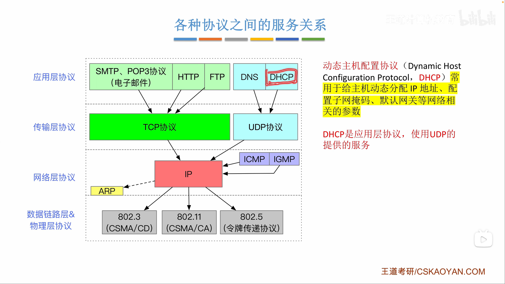
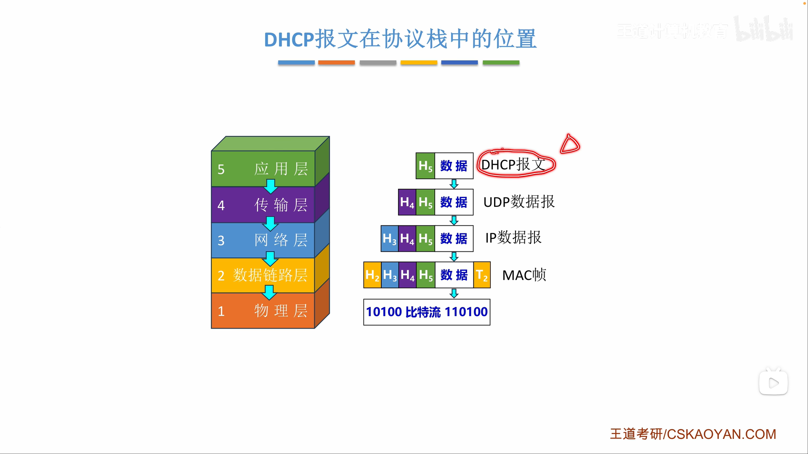
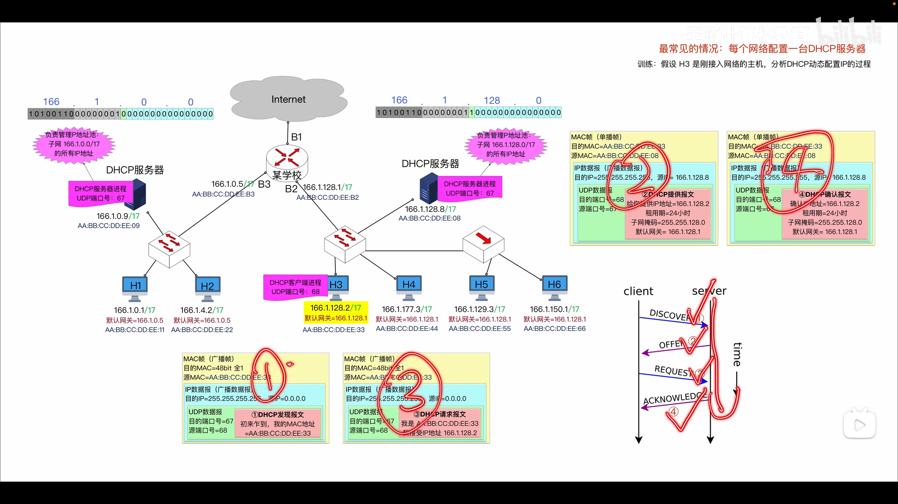
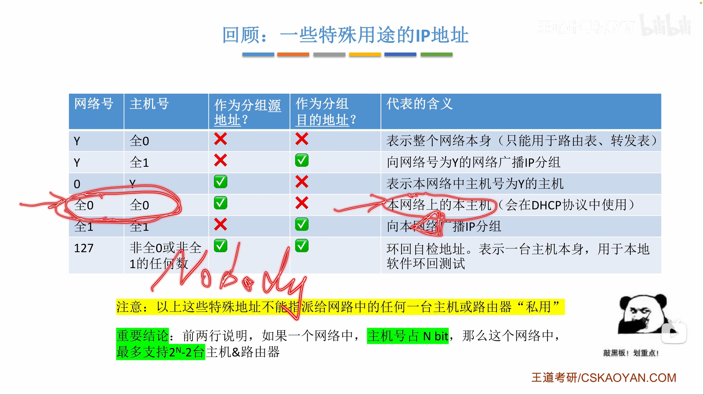
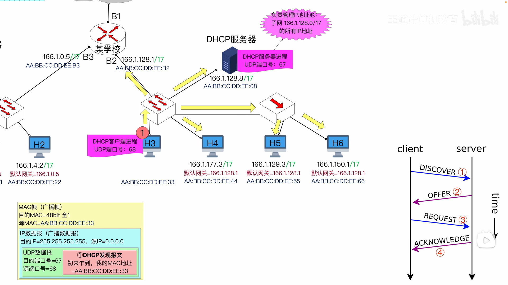
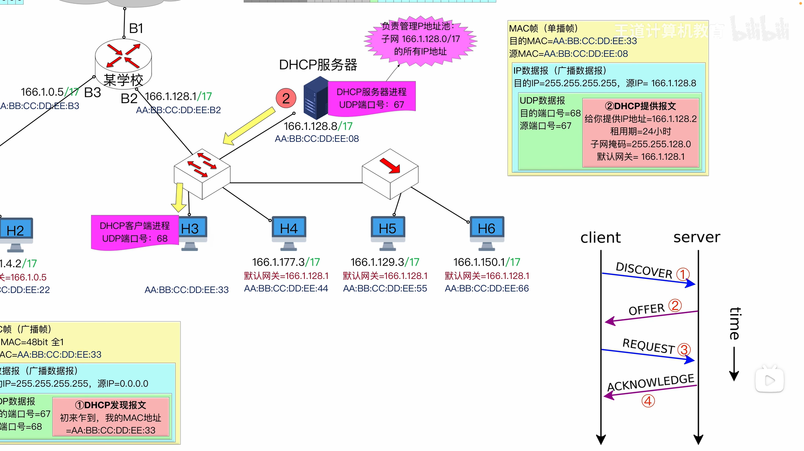
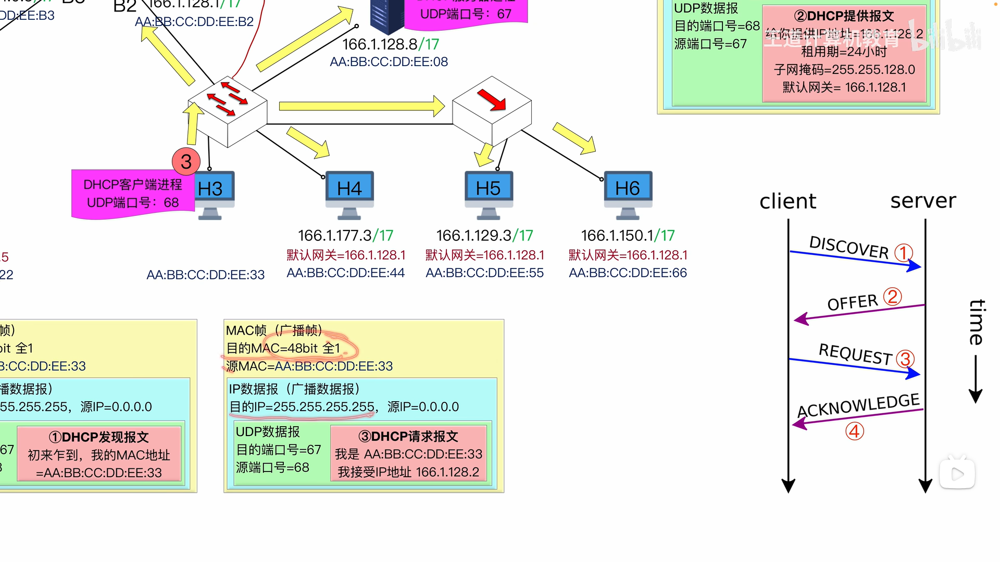
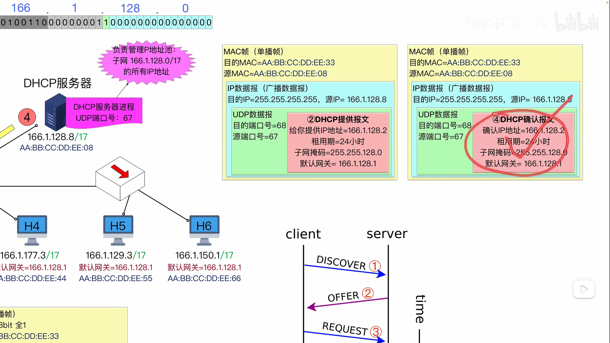
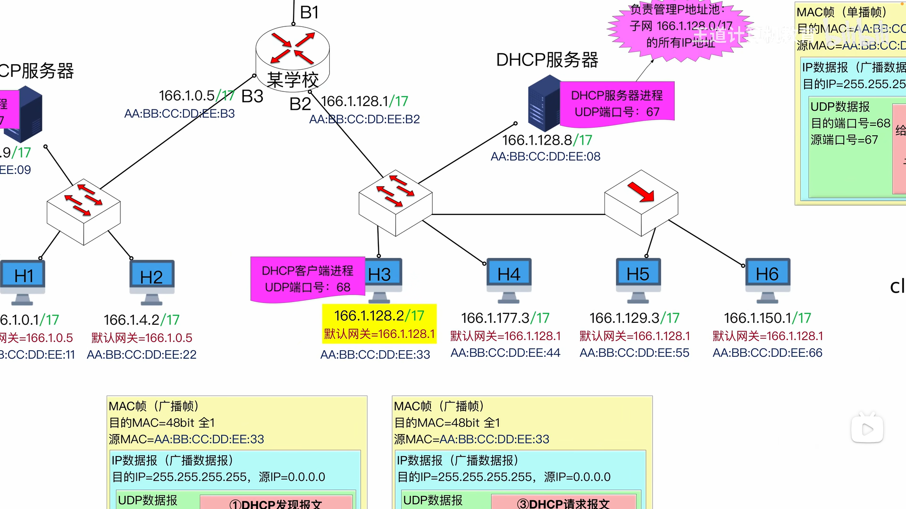
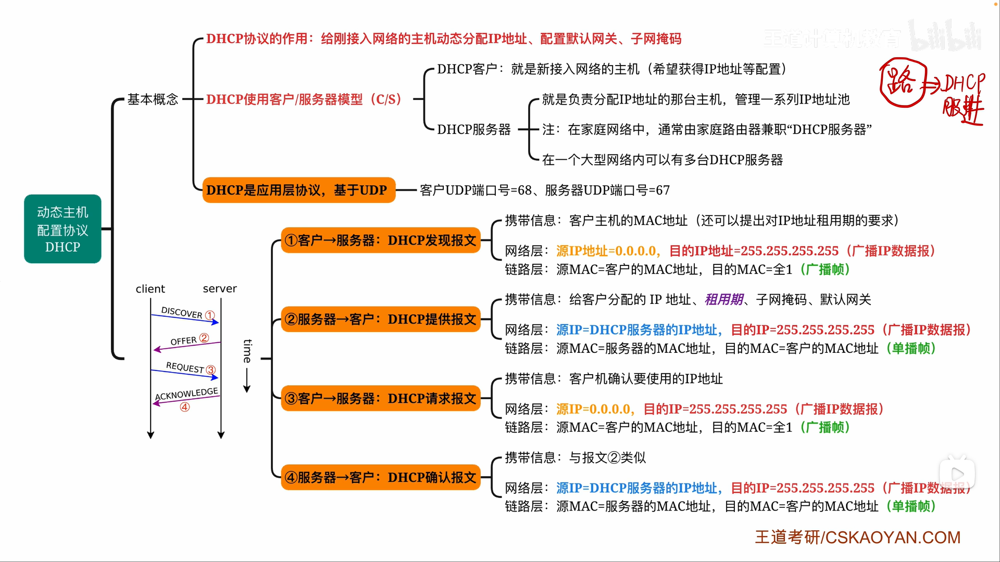

# 应用层

任务：

* 解决特定应用任务

常见应用：

## C/S模式、P2P模式

* 服务器总是处于运行状态，有固定端口号
* 虚拟服务器 —— 实现负载均衡

* 系统性能不会因为规模增大而降低（每个主机既是服务请求方，也是服务提供方）

## 动态主机配置协议 DHCP

* DHCP —— CS模式，给主机配置动态IP地址

* DHCP —— 为刚接入网络的主机分配 **IP地址**、**子网掩码**、**默认网关**、**DNS服务器**

* DHCP使用的传输层协议是**UDP协议**
* DHCP协议的**服务方端口是 67**，**客户方端口是 68**

* DHCP服务器 —— 负责管理整个子网的**IP地址分配**

1. DISCOVER

   

   

   * 发送方IP：0.0.0.0	发送方MAC：自己的MAC地址

     接收方IP：广播	    接收方MAC：广播

     发送端口：68	       接受端口：67

   * DHCP协议的 **服务方端口是 67**，**客户方端口是 68**

     由于特殊应用占用的端口号是**固定**的，计算机上不允许其它进程用到67号端口

     所以只有**DHCP**服务器能成功接收

2. OFFER

   

   * 发送方IP：DHCP服务器的IP	发送方MAC：DHCP服务器的MAC地址

     接收方IP：广播	    		 接收方MAC：DHCP客户的MAC地址

     发送端口：67	      		  接受端口：68

   * DHCP分配的IP地址是有**租用期**的

     租用期快到时，DHCP客户需要重新发送DHCP报文续租

3. REQUEST

   

   * 发送方IP：0.0.0.0	发送方MAC：自己的MAC地址

     接收方IP：广播	    接收方MAC：广播

     发送端口：68	      接受端口：67

   * 目前主机仍然认为自己的IP地址是0.0.0.0 —— 在ACKNOWLEDGE后，主机才能确认被分配到的IP地址

   * 为什么依然广播MAC、广播IP —— 一个子网可能有不止一个DHCP服务器，需要让所有DHCP服务器都统一确认

4. ACKNOWLEDGE

   

   * 发送方IP：DHCP服务器的IP	发送方MAC：DHCP服务器的MAC地址

     接收方IP：广播	    		 接收方MAC：DHCP客户的MAC地址

     发送端口：67	      		  接受端口：68

   * 和OFFER报文内容几乎一致，只是为了最后确认

* 新接入的主机，在接收到ACKNOWLEDGE报文后，终于确认了自己的IP地址、子网掩码、默认网关、DNS服务器

* DHCP客户端发送 **DHCP REQUEST 报文续租**

* 如果拒绝续租，DHCP服务器可以发送**DHCP NACK报文否认**，收到后客户端会立即停用当前IP地址

* DHCP客户端可以随时发送 **DHCP RELEASE报文停租**，主动停用当前IP地址

* DHCP服务器**分配IP地址**、DHCP客户端**最后接受IP地址**时 ——

  都需要根据**ARP协议**进行检测，**确保IP地址未被占用**

### DHCP中继代理

* DHCP中继代理 —— 让**路由器**成为**DHCP中继代理**
  * 如果每个网络都配置DHCP服务器，成本过高
  * 客户端的DHCP广播无法穿透路由器到达另一个网络的DHCP服务器
  * 因此给路由器配置DHCP服务器IP地址，让其成为DHCP中继，允许可以通过DHCP广播消息
  * 这样，**客户端就可以跨网络向DHCP服务器申请IP地址**

## 域名系统 DNS

* **DNS** —— CS模式，负责 **域名<->IP地址** 的转换

* DNS 报文使用的传输层协议是 **UDP协议**

  DNS服务器的端口号是 **53**

### 层级域名

* 域名具有层次结构，**最右方**的域名是**顶级域名**

* 顶级域名有三类 —— 国家、通用机构、反向域

* 不同层级可能出现重名

  * 顶级域名中有com，表示公司

  * 我国的二级域名中有com，表示我国企业

* 域名是逻辑概念，不受物理空间限制

### 层级域名服务器

* **根域名服务器** —— 世界上有**13个**根域名服务器，每个根域名服务器都存储了**所有顶级域名服务器**的域名<->IP地址映射

  **顶级域名服务器** —— 存储其管辖的**二级**域名服务器的域名<->IP地址映射

  **权限域名服务器** —— 存储其管辖的**下一级**域名服务器，其管辖的所有**主机**的域名<->IP地址映射

* **本地域名服务器 = 默认域名服务器** —— 不属于上述划分，仅指代询问信息进入域名服务器系统的**门户**域名服务器

### 递归查询 VS 迭代查询

* **迭代查询是本地域名服务器在查询，而不是主机在查询**
* 解决迭代查询对本地域名服务器而言性能压力大的问题：
  * **主机 -> 本地域名服务器，使用递归查询**
  * **域名服务器之间的查询，使用迭代查询**

* 用户的主机、域名服务器中都广泛使用了**DNS缓存**

  作用：1. 提高查询效率	2. 减少DNS报文查询数量

* DNS缓存应该设置**计时器**，超时记录不能使用（域名<->IP地址的映射关系可能会发生改变）

* 如果恰好有对应DNS缓存，本地域名服务器可以不向外发送查询（有DNS缓存，查询次数最少是0）
* 本地域名服务器最先访问根域名服务器，然后才知道对应的顶级域名服务器的IP地址（先访问"/"，得知".com"）

## 文件传送协议 FTP

* FTP —— CS模式，在主机间传输文件

* **主动模式** —— 有数据要传输时，FTP主动请求建立数据通道
* FTP使用传输层的**TCP协议**，服务器**控制端口是21，数据端口是20**

* 被动模式 —— 有数据要传输时，客户端请求建立数据通道，FTP服务器被动打开数据通道
* 对FTP服务器：
  * 控制端口21
  * 主动模式的数据端口是20，被动模式随机
* 对FTP客户端：都随机

##  电子邮件

* 电子邮件 —— CS模式，发件人和收件人都有自己的邮件服务器

* 邮件发送协议 如SMTP

  邮件读取协议 如POP3

* **用户代理 = 电子邮件客户端**
* 电子邮件三构件：客户端、服务器端、协议

* 发送方 -> 发送方服务器，SMTP

  发送方服务器 -> 接收方服务器，SMTP

  接收方服务器 -> 接收方 POP3

* SMTP和POP3都是CS模式，使用的传输层协议是TCP协议

* SMTP的服务器端口是 25
* 

# 11111111111111

## 网络应用模

## 万维网

### WWW

+ 万维网$WWW$是一个大规模联机式的信息储藏所，是无数个网络结点与网页的集合。
+ 是以$C/S$方式工作，浏览器就是客户端，文档所在的主机允许服务器程序。
+ 用户可以点击超链接获取资源，是通过超文本传输协议$HTTP$传输。
+ 万维网使用超文本标记语言$HTML$使得网页设计者可以从一个页面跳转到另一个页面并能显示页面。

### URL

统一资源定位符唯一标识资源，一般形式是：<协议>://<主机>:<端口>/<路径>。

$URL$不区分大小写。

$URL$可以使用$HTTP$也可以使用$FTP$。

### HTTP协议

+ 超文本传输协议定义了浏览器怎样向万维网服务器请求文档，以及服务器如何传输文档。
+ 服务器监听$TCP$运行于$80$端口。
+ $HTTP$可以不一次性下载完页面的所有资源，可以只下载文本部分，其他音频视频等待用户下一步请求之后再传输。

#### HTTP协议工作流程

1. 浏览器分析$URL$。
2. 浏览器向$DNS$请求解析$IP$地址。
3. $DNS$解析出$IP$地址。
4. 浏览器与服务器建立$TCP$连接。
5. 浏览器发出取文件命令。
6. 服务器响应。
7. 释放$TCP$连接。
8. 浏览器显示。

#### HTTP协议的特点

1. 无状态（即无法记忆用户），如果需要记忆就需要使用$Cookie$，是存储在用户主机的文本协议。
2. $HTTP$协议采用$TCP$连接，但是$HTTP$协议本身无连接，即交换$HTTP$报文之前不需要先建立$HTTP$连接。

#### HTTP协议的连接

$HTTP$连接包括：

+ 持久连接$Keep-alive$：
  + 非流水线。
  + 流水线。
+ 非持久连接$Close$。

![HTTP非持久连接][HTTPClose]

时间连接较长，每次需要$2RTT+$文档接收时间。

![HTTP持久连接][HTTPKeep]

这个图片是非流水线式，如果是流水线则一次性可以发送多个请求。

#### HTTP协议报文

$HTTP$报文分为请求报文和响应报文，因为其面向文本，所以报文中的每一个字段都是$ASCII$码串。

![HTTPformat]

+ 请求报文与响应报文的第一行叫做开始行，用于互相区分。分为请求行和状态行。
  + 请求报文的方法是指命令，就是对所请求的对象进行什么操作，如获取/删除等等。
  + $URL$就是资源标识符。
  + 状态码，表明服务器当前的状态:
    + $1xx$表示通知信息的，如请求收到了或正在处理。
    + $2xx$表示成功，如接受或知道了。
    + $3xx$表示重定向，如要完成请求还必须采取进一步的行动。
    + $4xx$表示客户的差错，如请求中有错误的语法或不能完成。
    + $5xx$表示服务器的差错，如服务器失效无法完成请求。
  + 版本是指使用的是什么版本的$HTTP$协议。
  + $CRLF$标识一行的结束，分别为回车和换行。同时，在整个首部行结束时，为了区别首部行和实体主体还会有一行单独的$CRLF$。
+ 首部行用于说明浏览器、服务器和报文主体的一些信息。每一行都需要回车和换行，最后还需要一个空行。
+ 实体柱体：请求报文一般不用，响应报文也可能没有。

| 方法（操作） |             意义              |                             作用                             |
| :----------: | :---------------------------: | :----------------------------------------------------------: |
|     HEAD     | 请求读取由URL标识的信息的首部 |       服务器可对HTTP报文响应但不返回请求对象，用于调试       |
|     GET      |    请求读取由URL标识的信息    |                      从服务器上获取数据                      |
|     POST     |  给服务器添加信息（如注释）   |                       向服务器传递数据                       |
|   CONNECT    |        用于代理服务器         | 将服务器作为代理，让服务器代替用户访问其他网页返回返回给用户 |

## 电子邮件

电子邮件是一种异步通信方式。

### 电子邮件格式

+ 信封：收件人的邮箱（是必须的，关键词$To:$）等。
+ 内容：
  + 首部：发送人的邮箱；主题（可选，关键词$Subject:$）等。
  + 主体：邮件内容。

电子邮件地址：收件人邮箱名@邮箱所在主机的域名。如$didnelpsun@gmail.com$。

### 电子邮件系统组成结构

应该包括三个部分：用户代理、邮件服务器、电子邮件协议。

![emailstructure]

用户代理$UA$的四个功能：

+ 撰写就是给用户编辑信件的环境。
+ 显示就是可以看到自己写的和自己收的信件内容。
+ 处理就是对信件进行操作，包括删除，打印，转发等等。
+ 通信就是可以将邮件发送到邮件服务器当中，同时可以从邮件服务器当中读取邮件。

邮件服务器的功能：

+ 邮件服务器端的发送和接受是指从自己的用户代理处接收邮件，之后向对面的邮件服务器发送邮件。
+ 邮件服务器的报告邮件发送结果就是投递是否成功这种情况。
+ 邮件服务器既可以作为客户端又可以作为服务器端，使用的是$C/S$方式。

协议：

+ 发邮件用的是$SMTP$。
+ 收邮件的是$POP3$或者$IMAP$。

### SMTP协议

简单邮件传送协议规定了两个互相通信的$SMTP$进程之间应该如何交换信息。

建立在$TCP$连接上，使用的端口号为$25$。

使用$C/S$模型，负责发送邮件的$SMTP$进程就是$SMTP$客户，负责接收邮件的进程就是$SMTP$服务器。

这里$SMTP$客户和服务器不是固定死的，可以也可以成为服务器，服务器也可以成为用户，由发送方和接收方决定，发送方就是客户，接收方就是服务器。

只支持传输$7$比特$ASCII$码内容，不支持二进制文本。

#### SMTP协议通信

$SMTP$规定了$14$条命令（几个字母）和$21$种应答信息（三位数字代码+简单文字说明）。具体的过程了解就可以。

令发送方邮件服务器为$A$，接收方邮件服务器为$B$。

1. 连接建立：
   1. 发送方将邮件发送给$A$（客户）的邮件缓存中。
   2. 每隔一段时间$A$就会扫描缓存，如果有邮件就准备使用$SMTP$协议与$25$号发送，与$B$建立$TCP$连接。
   3. $B$发出应答信息：$220\,Service\,ready$，表明可以发送。
   4. 然后$A$向$B$发送一个$HELLO$命令并附上发送方的主机名。
   5. 如果$B$有能力接收邮件，就应答：$250\,OK$。否则就应答：$421\,Service\,not\,available$。
2. 邮件发送：
   1. $A$会向$B$发送一个命令：$MAIL\,FORM:$<邮件发送者地址>。
   2. 如果$B$能接收，就返回：$250\,OK$，如果不能接收，就返回不能返回的原因的数字代码和英文说明。
   3. $A$收到允许发送的命令后，会发送多个$RCPT$命令：$RCPT\,TO:$<邮件接收者地址>，表示发送给谁。
   4. 如果$B$接收到并确认，就返回：$250\,OK$，如果$B$不能接收，就返回：$550\,No\,such\,user\,here$。
   5. $A$发送$B$一个$DATA$命令，表示要开始传输数据了。
   6. $B$返回：$354\,start\,mail\,input;end\,with$<$CR$><$LF$>.<$CR$><$LF$>。表示$B$同意传输。
   7. $A$开始传输数据。
   8. $A$发送命令：<$CR$><$LF$>.<$CR$><$LF$>表示数据传输已经结束。
   9. $B$返回：$250\,OK$表示明白传输已经结束。
3. 连接释放：
   1. 邮件发完，$A$发送$QUIT$命令表示要释放连接。
   2. $B$返回：$221$表示同意释放$TCP$连接。

### MIME协议

$SMTP$的缺点：

1. 不能传送可执行文件或其他二进制对象。
2. 仅限于传送$7$位$ASCII$码，不能传送其他非英语国家的文字。
3. $SMTP$服务器会拒绝超过一定长度的邮件。

通用因特网邮件扩充协议改善$SMTP$发送数据的缺点，是$SMTP$的功能性扩展。

![MIME协议][MIME]

$MIME$协议已经逐渐开始应用到浏览器当中，通过对不同文件类型用不同的标识符标识，来让浏览器读取通过$MIME$的相关文件。

### POP协议

邮局协议现在一般是$POP3$。建立于$TCP$连接上，端口号是$110$，使用$C/S$模型。

工作方式：

+ 下载并保存在服务器。
+ 下载并删除。

使用明文在传输层上传输密码，不进行加密。

与$SMTP$协议一样基于$ASCII$码，只能传输$ASCII$码，如果要传输非$ASCII$码则必须使用$MIME$。

同一个账户可以有多个邮件接收目录。

### IMAP协议

网际报文存取协议比$POP$协议更复杂。

提供创建文件夹，移动邮件、查询邮件等连接命令，从而维护了会话用户的状态信息。

当客户端打开$IMAP$服务器邮箱时，用户可以看到邮件的首部，只有打开某个邮件时才上传到用户本地计算机上。所以适用于低带宽的情况，避免取回不想取回的大数据。

可以在不同地方不同的计算机上随时处理邮件，还可以只读取邮件的一部分。

### 万维网邮件

此外，随着万维网的流行，目前出现了很多基于万维网的电子邮件，如$Hotmail$、$Gmail$等。这种电子邮件的特点是，用户浏览器与$Hotmail$或$Gmail$的邮件服务器之间的邮件发送或接收使用的是$HTTP$，而仅在不同邮件服务器之间传送邮件时才使用$SMTP$。

## DHCP协议

动态主机配置协议用于动态分配$IP$地址、子网掩码与默认网关等，使用客户/服务器方式，客户端与服务端通过广播方式进行交互，基于$UDP$协议（因为没有$IP$地址所以无法建立连接）。

提供即插即用机制，允许地址重用、移动用户加入网络、在用地址续租。

工作流程：

1. 主机广播“$DHCP$发现报文”，寻找网络中的$DHCP$服务器，从其中获得一个$IP$地址。
2. $DHCP$服务器收到“$DHCP$发现报文”后，广播“$DHCP$提供报文”，其中包括提供$DHCP$客户机的$IP$地址与配置信息。
3. $DHCP$客户机收到“$DHCP$提供报文”，接收$DHCP$服务器所提供的相关参数，客户机广播“$DHCP$请求报文”，向$DHCP$服务器请求提供$IP$地址。
4. $DHCP$服务器广播“$DHCP$确认报文”，将$IP$地址分配给$DHCP$客户机。
