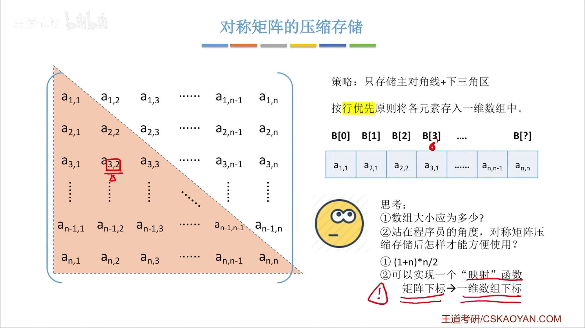
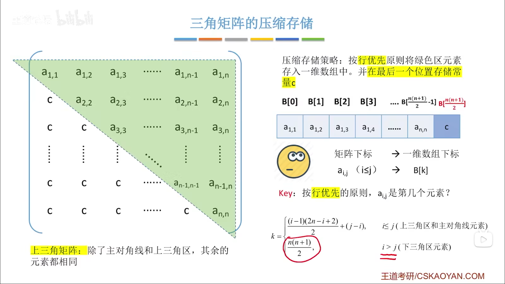
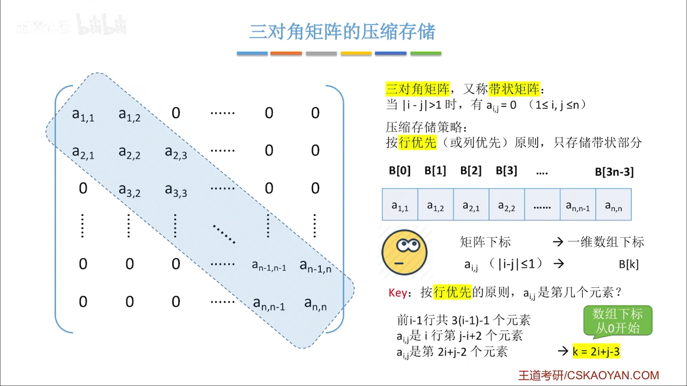
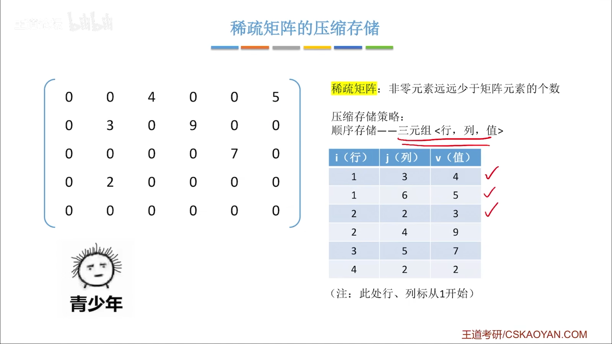
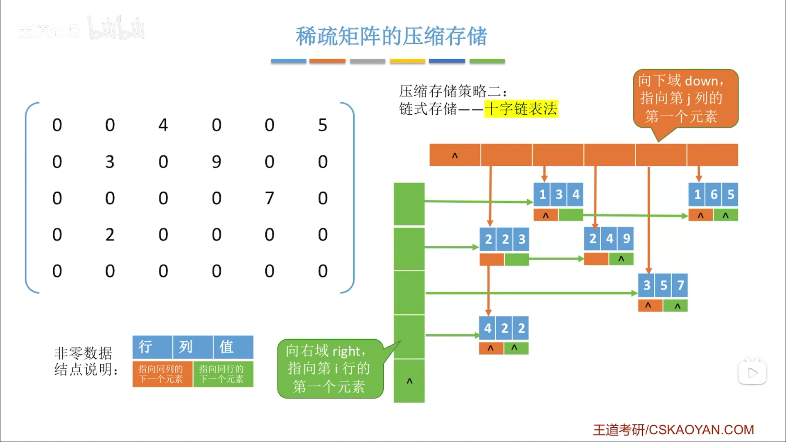

# 数组

## 数组的定义

数组是由**同类型**的数据元素构成的**有序集合**，每个元素是数组元素，每个元素受$n$个线性关系的约束。其中每个元素在$n$个线性关系中的序号就是元素的下标，可以通过下标来访问元素。

数组是对线性表的推广。

数组一旦被定义其维数和维界就不能改变，所以数组只能对结构的初始化和销毁，以及元素的存取和修改。

所以数组的重点在于其存储。

## 数组的存储结构

### 一维数组

各数组元素大小相同，且物理上连续存放。

数组元素$a[i]$的存放地址=起始地址$LOC+i\times sizeof(ElemType)$。数组下标从$0$开始。

### 二维数组

二维数组存储方式还是同一维数组一样连续的。已知二维数组$b[M][N]$。

+ 行优先：一行一行存储。$b[i][j]$的存储地址=起始地址$LOC+(i\times N+j)\times sizeof(ElemType)$。

+ 列优先：一列一列存储。$b[i][j]$的存储地址=起始地址$LOC+(j\times M+i)\times sizeof(ElemType)$。

## 特殊矩阵

压缩存储指为多个值相同的元素只分配一个存储空间从而节省存储空间。

### 对称矩阵压缩存储

常考题目是给一个矩阵元素，要求判断映射到一维数组的下标，这要判断：

（1） 上三角？下三角？是否在存储的范围内？（如果不是，要把$a_{ij}$替换成$a_{ji}$）

（2）行存储？列存储？

（3） 矩阵下标 从0开始 ？从1开始？

（4） 一维数组下标 从0开始？从1开始？

也会考察给定存储方式和一维数组下标，要求判断映射前的矩阵元素下标。

### 三角矩阵压缩存储

和对称矩阵的区别就是要多一个位置存C，其他基本相同

### 三对角矩阵的压缩存储

### 稀疏矩阵的压缩存储

#### 顺序存储

失去了随机存储的特性

#### 十字链表法

